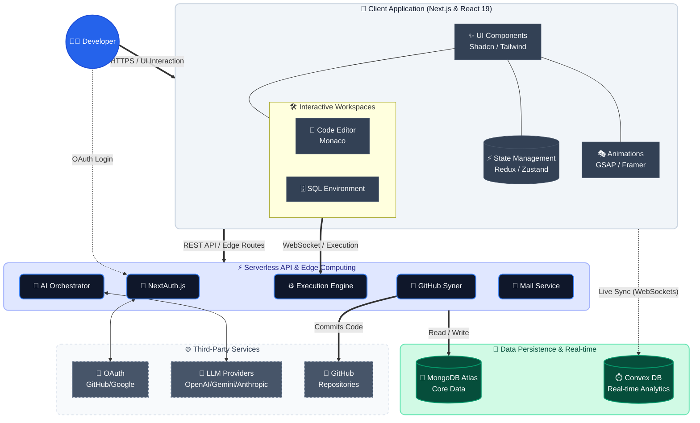

<div align="center">
  

  <h1 align="center">CodeCraft 🚀</h1>

  <p align="center">
    <strong>An advanced AI‑powered coding and SQL practice platform designed to help developers upgrade there skills.</strong>
  </p>

  <p align="center">
    <a href="#-about-the-project">About</a> •
    <a href="#-key-features">Features</a> •
    <a href="#-system-architecture">Architecture</a> •
    <a href="#%EF%B8%8F-tech-stack">Tech Stack</a> •
    <a href="#-getting-started">Getting Started</a> •
    <a href="#-contributing">Contributing</a>
  </p>
</div>

---

## 💡 About the Project

**CodeCraft** is a modern, full-stack practice environment engineered to simulate real-world technical interviews. 

By leveraging advanced Large Language Models (LLMs) like GPT-4, Gemini, and Claude, CodeCraft dynamically generates algorithmic challenges and SQL scenarios tailored to your skill level. Complete with a built‑in execution engine, real‑time analytics, and seamless GitHub integration, it provides an end‑to‑end experience to practice, track progress, and continuously build your coding portfolio.

---

## ✨ Key Features

### 🤖 AI‑Driven Question Generation
Dynamically generate tailored algorithmic and database challenges (Easy, Medium, Hard) using top-tier LLMs:
- **OpenAI GPT‑4**, **Google Gemini**, **Anthropic Claude**, and **Groq**

### 💻 Professional Workspace Experiences
- **Coding Workspace:** Powered by **Monaco Editor** (the engine behind VS Code) featuring deep IntelliSense, syntax highlighting, and a distraction-free developer flow.
- **SQL Workspace:** A fully-featured SQL environment boasting features like multiple dialects (MySQL, PostgreSQL, Oracle SQL, SQLite), automatic mock schema generation, and real-time execution.

### ⚡ Robust Execution Engine & Validation
- **Multi-language Support:** JavaScript, TypeScript, Python, Java, C++, and more.
- **Run → Submit Workflow:** Code and SQL queries must pass all dynamically generated edge cases before submission, ensuring strict validation similar to leading interview platforms like LeetCode.

### 📊 Real‑Time Progress Analytics
- Live dashboards powered by **Convex** tracking problems solved, difficulty distributions, and community statistics without refreshing the page.

### 🐙 GitHub Portfolio Integration
- Securely connect your GitHub account via NextAuth to automatically instantiate repositories and push accepted solutions on the fly. Let your practice act as your glowing portfolio.

### 🛡️ Enterprise‑Grade Security & Operations
- **Authentication:** OAuth strategies handled by NextAuth (GitHub, Google, Credentials).
- **Security:** AES‑256‑GCM encryption for stored user tokens.
- **Reporting:** Automated email reports powered by `nodemailer` detailing session performance and code analytics.

---

## 🏗️ System Architecture

CodeCraft features a modern, serverless ecosystem optimized for low-latency code evaluation and responsive real-time state management.



---

## 🛠️ Tech Stack

Built heavily with modern web technologies for scalability, reliability, and unparalleled UX depth.

### Frontend
- **Framework:** Next.js (App Router, v16.2+)
- **Library:** React 19
- **State Management:** Redux Toolkit & React-Redux (Primary State), Zustand (Legacy/Local State Migration)
- **Styling & UI:** Tailwind CSS v4, Shadcn/UI (Radix Primitives), `clsx`, `tailwind-merge`
- **Animations:** Framer Motion, GSAP, Lenis (Smooth Scrolling)
- **Editor:** `@monaco-editor/react`

### Backend & AI
- **Runtime:** Node.js (Vercel Edge & Serverless functions)
- **AI SDKs:** `@openai/api`, `@google/generative-ai`, `@anthropic-ai/sdk`
- **PDF & Communication:** `pdfkit`, `jspdf`, `nodemailer`
- **Security:** NextAuth (v5 beta), `jose`, `uuid`

### Data Layer
- **NoSQL Database:** MongoDB (via `mongoose` and `@auth/mongodb-adapter`)
- **Real-Time Data Sync:** Convex (`convex`, `convex-helpers`)

---

## 🚀 Getting Started

### 1. Prerequisites
- Node.js (v18+)
- npm / yarn / pnpm
- MongoDB Atlas Cluster
- Convex Account
- OAuth Credentials (Google & GitHub)
- API Keys for AI Providers (OpenAI, Gemini, Authropic)

### 2. Installation Setup

Clone the repository:
```bash
git clone https://github.com/your-username/codecraft.git
cd codecraft
```

Install the dependencies:
```bash
npm install
```

### 3. Environment Configuration
Create a `.env.local` file in the root directory and supply required identifiers:

```env
# Database
MONGODB_URI=your_mongodb_connection_string
CONVEX_DEPLOYMENT=your_convex_deployment
NEXT_PUBLIC_CONVEX_URL=your_convex_url

# Authentication
AUTH_SECRET=your_nextauth_secret
AUTH_GITHUB_ID=your_github_client_id
AUTH_GITHUB_SECRET=your_github_client_secret
AUTH_GOOGLE_ID=your_google_client_id
AUTH_GOOGLE_SECRET=your_google_client_secret

# AI Providers
OPENAI_API_KEY=your_openai_api_key
GEMINI_API_KEY=your_gemini_api_key
ANTHROPIC_API_KEY=your_anthropic_api_key

# Optional Integrations
SMTP_HOST=your_smtp_host
```

### 4. Initialize Database & Run

Initialize your real-time data sync environment:
```bash
npx convex dev
```

Run the local development server:
```bash
npm run dev
```

Open [http://localhost:3000](http://localhost:3000) in your browser to view the application in action.

---

## 📁 Project Structure

```text
codecraft/
├── @types/          # Global TypeScript type definitions
├── app/             # Next.js App Router (Pages, API Routes, Layouts)
│   ├── (marketing)/ # Marketing pages and docs
│   ├── (platform)/  # Main platform (Dashboard, IDE)
│   └── api/         # Serverless API endpoints
├── components/      # Reusable React UI components (radix, custom editors)
├── convex/          # Convex real-time schemas and mutation functions
├── lib/             # Shared utilities (crypto, email, API helpers)
├── models/          # Mongoose database models
├── store/           # Redux Slices & Zustand stores
├── public/          # Static assets (images, fonts)
└── ...config files  # Tailwind, ESLint, Next config, Package.json
```

---

## 🤝 Contributing

Community contributions make the open-source community an incredible place to learn, inspire, and create.

1. Fork the Project
2. Create your Feature Branch (`git checkout -b feature/AmazingFeature`)
3. Commit your Changes (`git commit -m 'Add some AmazingFeature'`)
4. Push to the Branch (`git push origin feature/AmazingFeature`)
5. Open a Pull Request

---

## 📜 License

Distributed under the **MIT License**. See `LICENSE` for more information.

---

<div align="center">
  <sub>Built with ❤️ for developers leveling up their coding skills.</sub>
</div>
